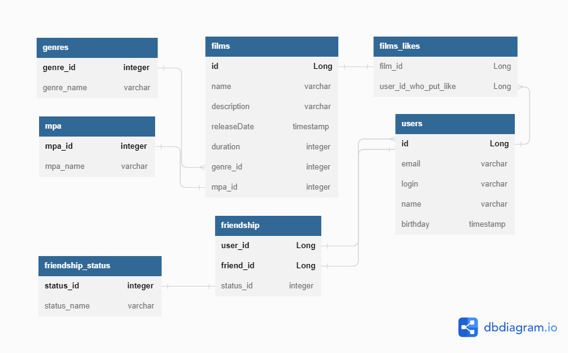

# java-filmorate
Template repository for Filmorate project.

##  Схема базы данных Filmorate project

## Примеры запросов для основных операций :
1) Выводим список всех фильмов SELECT * FROM films;
2) Выводим список всех пользователей SELECT * FROM users;
3) Выводим список всех жанров SELECT * FROM genres;
